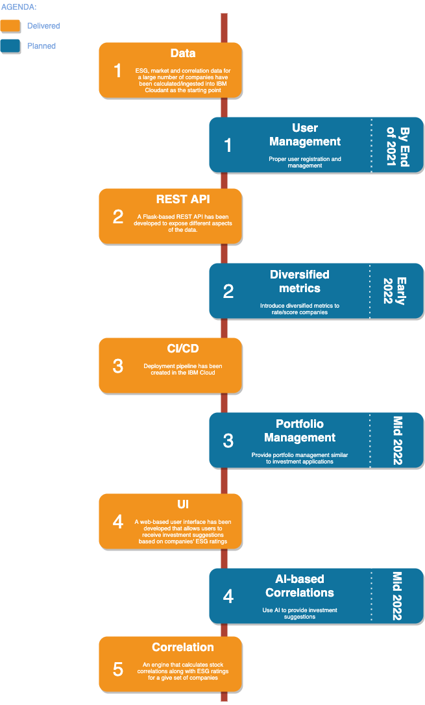

# greenup

*greenup* your portfolio, save the *planet*

## Contents

- [greenup](#greenup)
  
  - [Contents](#contents)
  
  - [What's the problem](#the-problem)
  
  - [How can technology help?](#how-can-technology-help)
  
  - [The idea](#the-idea)
  
  - [Demo video](#demo-video)
  
  - [Architecture](#architecture)
  
  - [Details](#details)
  
  - [Roadmap](#roadmap)
  
  - [Getting started](#getting-started)
  
  - [Live demo](#live-demo)
  
  - [Built with](#built-with)
  
  - [Contributing](#contributing)
  
  - [Versioning](#versioning)
  
  - [Authors](#authors)
  
  - [License](#liecense)
  
  - [Acknowledgments](#acknowledgments)

## The problem

Investment triggers growth both for the investee and the investor; now, what if we could direct the investments towards sustainable companies? Quick answer is that a *third entity* would be implicitly added to the investee-investor equation that nowadays requires the highest level of attention. Environement, planet, earth or simply the *third entity* would benefit the most from investing in sustainable companies.

## How can technology help?

Technology assists in 3 main areas:

1. _Data_: This is the building block. We need to extract, normalize and process data that supports investments decisions.

2. _Platform_: Tools and infrastructure that support the service. 

3. _Decision Making_: The logic that enables users to decide on their investment choices.

## The idea

*greenup* is an application that allows investors to arrange/re-arrange their investment portfolio according to companies' ESG (Enviromental, Social and Governance) performance. This is acheived by suggesting stocks that have higher ESG ratings and, in the mean time, perform similar to what the user already has in his/her investment portfolio.

## Demo video

## Architecture

Check the below diagram:

1. User accesses the *greenup* UI and enters a ticker (stock symbol)

2. Backend extracts company details, processes stock correlation and retrieves ESG ratings 

3. UI provide suggestions based on stock performance and ESG ratings

4. User can form an investment portfolio based on the suggestions

## Details

Technically speaking, the application has three main components:

1. Data store: A repository where ESG ratings and indicators along with stock correlation data and company details are stored. We use resources like ***ESG Enterprise*** and ***Yahoo Finance*** to extract these data and store it in the ***IBM Cloud***.

2. API: A RESTful API in front of the data store which exposes the data in the form of services consumable by the UI.

3. UI: A web-based application which leverages the API to implement/deliver the service to the end users.

## Roadmap

The project has been deployed in a Kubernetes cluster within *IBM Cloud*. Here is the development plan for the project as well as the delivered items:

## Getting started

1. Browse the UI

2. Enter a ticker (stock symbol) to start

3. Review the suggestions provided by the system

4. Organize an investment portfolio based on suggestions

## Live demo

| Endpoint | Address                                         |
| -------- | ----------------------------------------------- |
| API      | http://52.117.182.214:31587/swagger/api-docs/#/ |
| UI       | http://corentinthomasset.me/call-for-code/#/    |

## Built with

- [IBM Cloudant](https://cloud.ibm.com/catalog?search=cloudant#search_results) - Storage for JSON documents

- [Python Flask](https://flask.palletsprojects.com/en/2.0.x/) - REST API

- [Vue.js](https://vuejs.org/) - User interface

- [Kubernetes on IBM Cloud](https://cloud.ibm.com/catalog?search=kubernetes%20service#search_results) - Service infrastructure

## Contributing

* Fork the repository.

* Commit your changes to your fork.

* Submit a pull request.

* Handle any feedback before the request is merged.

## Versioning

The project uses semantic versioning. Check the available versions [here](https://github.com/corentinthomasset/ibm-call-for-code-2021/tags).

## Authors

* Corentin Thomasset

* Fabio De Oliveira Padilha

* Mitra Nami

* Sheetal Lamba

* Ali Majdzadeh-Kohbanani

## License

This project is licensed under the Apache 2 License - see the [LICENSE](LICENSE) file for details.

## Acknowledgments

- [ESG Enterprise](https://www.esgenterprise.com/) for providing access to their ESG API
